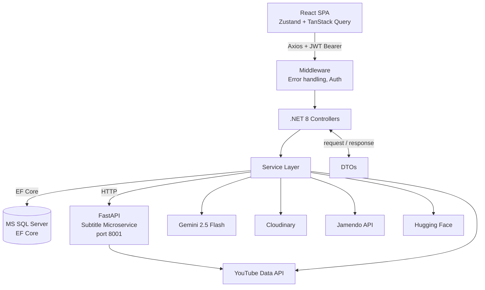

# 📈 Mist

**Mist** is an AI-powered content generation platform for YouTube creators.
It takes a YouTube video as input and produces a ready-to-publish content package for every social platform in under 30 seconds.

Creating a video is only half the work. Writing captions for Instagram, LinkedIn, TikTok, picking hashtags, finding a photo - manually, after every upload. Existing tools like Repurpose.io, Lately.ai, Castmagic and Quso.ai are paid, English-only, and built for teams. Mist fills that gap: free, Ukrainian-language, built for solo content makers.

[](https://learn.microsoft.com/en-us/aspnet/core/)
[](https://react.dev/)
[](https://learn.microsoft.com/en-us/sql/sql-server/)
[](https://fastapi.tiangolo.com/)
[](https://ai.google.dev/gemini-api/docs)


---

## 🎥 Demo

> Demo video coming soon.

📌 *Note:* The project requires local database setup and API keys configuration.
For a full walkthrough of all features, a demo presentation video is provided.

👉 [Watch demo video](#) *(link coming soon)*

---

## ⚙️ Technologies

- **Backend:** ASP.NET Core (.NET 8) - REST API, service layer architecture, centralized error handling via middleware
- **ORM:** Entity Framework Core (Database First) - models generated via `Scaffold-DbContext`
- **Database:** MS SQL Server - normalized to 3NF, soft delete pattern, unique composite indexes
- **Auth:** ASP.NET Identity + JWT - `[Authorize]` on protected endpoints, HmacSha256 signing
- **Frontend:** React + Vite - SPA with React Router v6, protected routes via `Outlet` pattern
- **State management:** Zustand - global auth state and JWT storage; TanStack Query - server state and caching
- **HTTP:** Axios with interceptors - automatic token injection, centralized 401 handling
- **Styling:** Tailwind CSS
- **Microservice:** Python + FastAPI - subtitle extraction via `youtube-transcript-api`, runs on port 8001
- **AI generation:** Gemini API (gemini-2.5-flash) - chain fallback: flash -> flash-lite -> template
- **Image processing:** Cloudinary - upload once, transform via URL params (`c_fill,g_auto,f_auto,q_auto`)
- **Video metadata:** YouTube Data API v3
- **Music:** Jamendo API - Creative Commons tracks, search by genre and title
- **Image AI:** Hugging Face Inference API - image generation from text prompt

---

## ✨ Features

**Content generation**
- Fetch video metadata (title, description, tags, thumbnail) and subtitles automatically from a YouTube URL
- Generate platform-specific posts for Instagram, TikTok, Twitter/X, LinkedIn with correct character limits
- Apply a preset tone (informative, emotional, provocative) or a custom prompt per platform
- Fallback to title and tags when subtitles are unavailable

**Images**
- Three sources: YouTube thumbnail, user upload, or AI-generated image
- Automatic cropping to every platform format (square, portrait, vertical) via Cloudinary URL transforms - no re-uploading

**Music**
- Search and preview Creative Commons tracks
- Optional step - skippable without affecting generation

**Results**
- Inline editing of text and hashtags
- One-click copy
- Download individual photos in any format
- Download a full ZIP archive structured by platform: `/instagram/text/post.txt`, `/instagram/photo/`, `/tiktok/text/` etc.

**History and profile**
- Full generation history with search and platform filter
- Profile stats: total generations, favorite platform, days active
- Avatar, editable credentials, password change
- Account deletion with data integrity preserved (soft delete)

---

## 🏗️ Architecture

The project follows a service-oriented architecture with a dedicated Python microservice for subtitle extraction.



---

## 💡 Challenges and Design Decisions

**Python microservice for subtitles** — `youtube-transcript-api` has no reliable .NET equivalent. Extracted into a separate FastAPI service; main API degrades gracefully if it's unavailable.

**Cloudinary URL transforms** — images are uploaded once and adapted to all platform formats via URL params (`c_fill,g_auto`). No server-side processing, no duplicate storage.

**Zustand + TanStack Query** — Zustand holds only auth state and JWT token. TanStack Query owns all server data: caching, refetching, loading and error states.

**Gemini fallback chain** — on a 429 or timeout, the system automatically tries flash-lite, then falls back to a structured template. The user always gets a result.

**Soft delete** — physically removing a user breaks foreign key constraints across generation history. `IsDeleted = true` blocks login while keeping all relational data intact.

---

## 🧪 Testing

`Mist.Tests` - xUnit, Moq, FluentAssertions. **44 tests across 4 services.**

Each test uses an isolated InMemory database with a unique `Guid` name.

| Service | Tests | Coverage |
|---|---|---|
| `VideoService` | 17 | `ExtractYoutubeId` via `[Theory]` + `[InlineData]` across all YouTube URL formats; `ParseDuration` via reflection |
| `ProfileService` | 11 | Get profile, update (duplicate email, own email), change password, soft delete |
| `AuthService` | 8 | Register (duplicate, weak password, success), login (not found, deleted account, wrong password, success), `GetMeAsync` |
| `GenerationPlatformService` | 8 | Exception paths (platform/video not found), platform-specific fallback text tested via reflection |

---

## 📁 Project Structure

```
Mist/
├── backend/
│   ├── Mist/
│   │   ├── Controllers/
│   │   ├── Services/
│   │   ├── DTOs/
│   │   ├── Models/               # EF Core scaffold
│   │   └── transcript_service/   # Python FastAPI microservice
│   └── Mist.Tests/
│
├── frontend/
│   └── src/
│       ├── api/
│       ├── components/ui/
│       ├── pages/
│       ├── store/
│       ├── hooks/
│       └── utils/
│
└── database/                     # SQL creation script + seed data
```

---

## 🚀 Getting Started

**Check prerequisites**

```bash
dotnet --version    # 8.x
node --version      # 18+
python --version    # 3.10+
```

**Database**

SQL creation script and seed data are in `/database`.

**Backend**

```bash
cd backend/Mist
# Fill in appsettings.json (see API Keys below)
dotnet restore
dotnet run
```

**Python microservice**

```bash
cd backend/transcript_service
pip install -r requirements.txt
uvicorn main:app --port 8001
```

**Frontend**

```bash
cd frontend
npm install
# Create frontend/.env with:
# VITE_API_URL=http://localhost:5000
npm run dev
```

**Tests**

```bash
cd backend/Mist.Tests
dotnet test
```

---

## 🔑 API Keys

Fill in `appsettings.json` in the `Mist` project:

| Key | Where to get |
|---|---|
| `YouTube:ApiKey` | [Google Cloud Console](https://console.cloud.google.com/) |
| `Gemini:ApiKey` | [Google AI Studio](https://aistudio.google.com/) |
| `Cloudinary:CloudName / ApiKey / ApiSecret` | [Cloudinary](https://cloudinary.com/) |
| `Jamendo:ClientId` | [Jamendo Developer](https://developer.jamendo.com/) |
| `HuggingFace:ApiKey` | [Hugging Face](https://huggingface.co/settings/tokens) |
| `JwtSettings:SecretKey` | any long random string |

---

Creator: **Kateryna Babych** — [LinkedIn](https://www.linkedin.com/in/babych-kate) | [Email](mailto:babychkatia14@gmail.com) | Lviv Polytechnic National University, 2026
